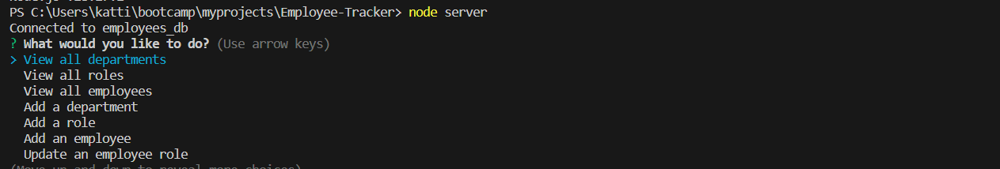
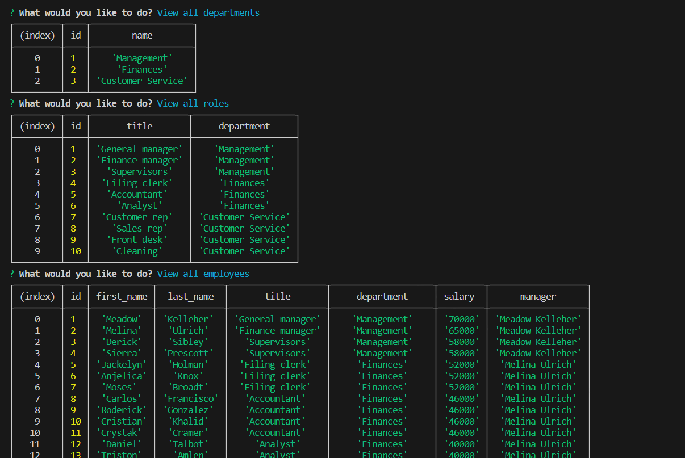

# Employee-Tracker

 
  

## Description
📙 This app allows user to see/modify employee data by department, manageres, roles and employees. 

## Table of Contents
- [Description](#description)
- [Installation](#installation)
- [Usage](#usage)
- [License](#license)
- [Contributing](#contributing)
- [Tests](#tests)
- [Questions](#questions)

## Installation
⚙️ User need to run all dependencies by running npm i
⚙️ Source connection in mysql by running:
mysql -u root -p
source db/schema.sql
source db/seeds.sql
⚙️ Then run the app with node server

## Usage
💻 When run by user, they are presented by the table of content where they can choose data table they are interested in, as well as update/remove data

## Video Guide

## License

 

This application is covered by the MIT license. 

## Contributing

Used mini project as reference

Generated random names:  https://catonmat.net/tools/generate-random-names

## Tests
📝 No

Find me on GitHub: [Misachka](https://github.com/Misachka)

